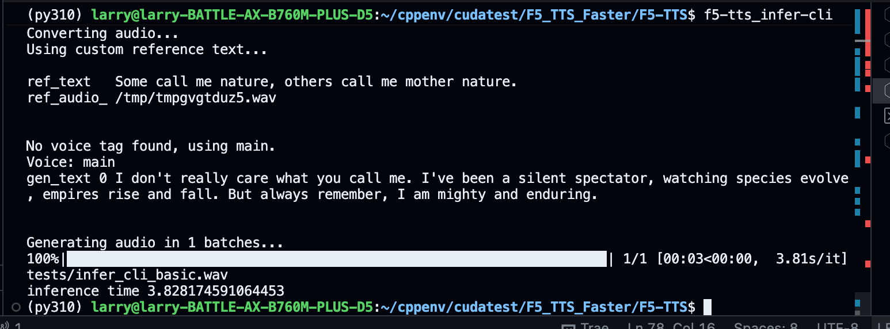
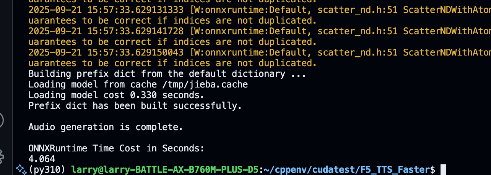
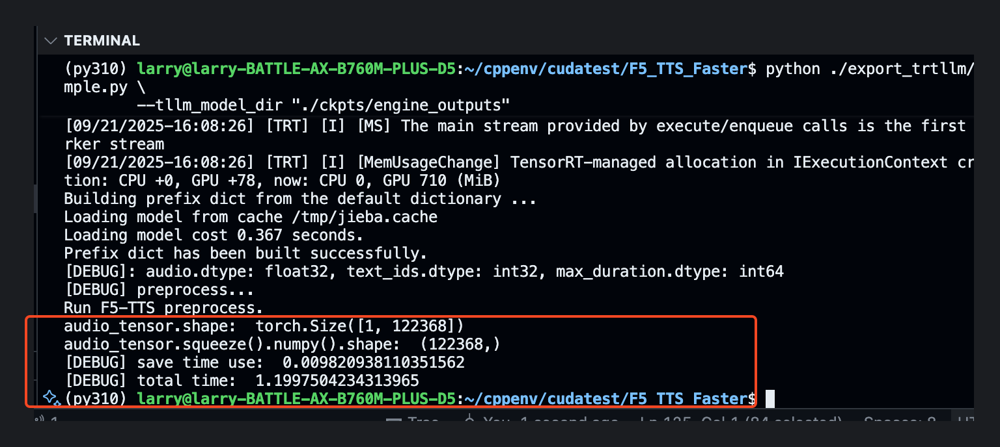

## F5-TTS的onnxruntime和tensorrt-llm推理

### 环境配置

1. 安装pytorch, cuda, onnxruntime, tensor

需要保证版本兼容，我本地环境是
```
python==3.10

nvidia版本
nvidia-smi 驱动版本12.9
nvidia nvcc版本12.4

torch版本
torch                                    2.6.0+cu124
torchaudio                               2.6.0+cu124
torchdiffeq                              0.2.5
torchprofile                             0.0.4
torchvision                              0.21.0+cu124

onnxruntime版本
onnxruntime-gpu                          1.20.0

tensorrt版本
tensorrt                                 10.9.0.34
tensorrt_cu12                            10.9.0.34
tensorrt_cu12_bindings                   10.9.0.34
tensorrt_cu12_libs                       10.9.0.34
tensorrt-llm                             0.18.0

vocos
vocos                                    0.1.0
```
python的包兼容性很差，换个版本可能跑不通了

2. 本地安装F5-TTS

F5-TTS 来自
```
git clone https://github.com/SWivid/F5-TTS.git -b 0.6.2
cd F5-TTS
pip install -e .
```

由于python模块变化很快，因此在本地也放了F5-TTS的代码，避免以后找不到

运行F5-TTS
f5-tts_infer-cli



### onnxruntime推理
1. 设置.env文件里的环境变量
2. 将 torch模型转为onnx模型

python ./export_onnx/Export_F5.py

会覆盖f5-tts和 vocos下的 文件
```
# f5-tts模块
dit.py
modules.py
util_infer.py

# vocos 模块
heads.py
models.py
modules.py
pretrained.py

shutil.copyfile(modified_path + '/vocos/heads.py', python_package_path + '/vocos/heads.py')
shutil.copyfile(modified_path + '/vocos/models.py', python_package_path + '/vocos/models.py')
shutil.copyfile(modified_path + '/vocos/modules.py', python_package_path + '/vocos/modules.py')
shutil.copyfile(modified_path + '/vocos/pretrained.py', python_package_path + '/vocos/pretrained.py')
shutil.copyfile(modified_path + '/F5/modules.py', F5_project_path + '/f5_tts/model/modules.py')
shutil.copyfile(modified_path + '/F5/dit.py', F5_project_path + '/f5_tts/model/backbones/dit.py')
shutil.copyfile(modified_path + '/F5/utils_infer.py', F5_project_path + '/f5_tts/infer/utils_infer.py')
```
覆盖的原因后续研究下

3. 可以直接执行`python ./export_onnx/F5-TTS-ONNX-Inference.py` 推理


时间和torch时间都是4s左右，但需要注意由于覆盖了文件，这和原本的f5-tts代码不同了。
后续可以深入分析下

### tensorrt-llm加速

1. 在tensorrt-llm 增加f5-tts的模块

找到tensorrt_llm的安装模块`pip show tensorrt-llm`
在`~/miniconda3/envs/py310/lib/python3.10/site-packages/tensorrt_llm/models`，创建f5tts目录。

将F5_TTS_Faster/export_trtllm/model下面的文件拷贝到`~/miniconda3/envs/py310/lib/python3.10/site-packages/tensorrt_llm/models`

在`tensorrt_llm/models/__init__.py`中增加

```python
from .f5tts.model import F5TTS

__all__ = [..., 'F5TTS']

# 并且在 `MODEL_MAP` 添加模型：
MODEL_MAP = {..., 'F5TTS': F5TTS}
```

2. 执行convert-checkpoint.py

```
python ./export_trtllm/convert_checkpoint.py \
        --timm_ckpt "./ckpts/F5TTS_Base/model_1200000.pt" \
        --output_dir "./ckpts/trtllm_ckpt"

```

3. build_engine

```
trtllm-build --checkpoint_dir ./ckpts/trtllm_ckpt \
             --remove_input_padding disable \
             --bert_attention_plugin disable \
             --output_dir ./ckpts/engine_outputs
```

4. 执行推理

```
python ./export_trtllm/sample.py \
        --tllm_model_dir "./ckpts/engine_outputs"
```

推理耗时,1.2s


### TODO

1. export_onnx/modeling_modified目录下都改了什么文件，作用是什么，为什么要改

2. /export_trtllm/model 目录下加的文件有什么作用，为什么tensorrt-llm将推理时间从4s提升到1.2s，关键优化是什么